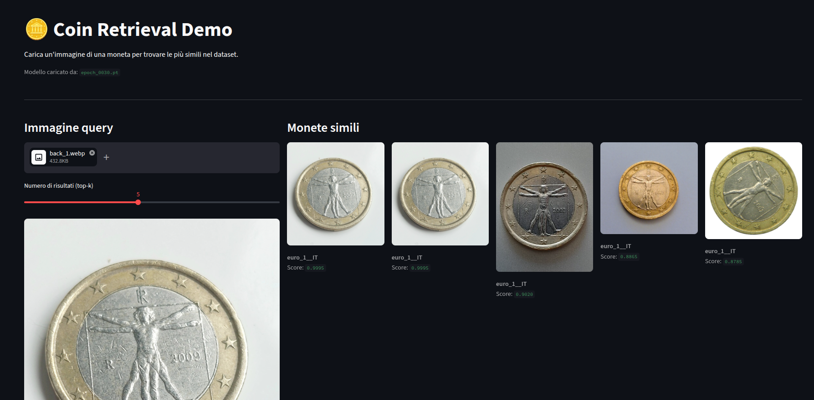

# Coin Retrieval Engine

**Not a classifier.** No fixed label set. No retraining when you add new coins. Just learned similarity.


## Demo





```
Query: photo of 1€ Italy
─────────────────────────────────────────────────────────────────
#1  euro_1__IT          similarity: 0.9995   ████████████████████
#2  euro_1__IT          similarity: 0.9995   ████████████████████
#3  euro_1__IT          similarity: 0.9020   ██████████████████
#4  euro_1__IT          similarity: 0.8865   █████████████████
#5  euro_1__IT          similarity: 0.8785   █████████████████

```

---

## Why retrieval, not classification?

| Approach | Classification | **This system** |
|---|---|---|
| Adding new coins | Retrain from scratch | Add images, rebuild index |
| Data requirement | 100s of images/class | 10+ images/class |
| Unseen variants | Wrong prediction | Finds closest known match |
| Explainability | Softmax score | Returns actual reference images |

Coins exist in thousands of variants — country × denomination × era × minting series. A closed-label classifier cannot scale to that. A retrieval system does.

---

## Architecture

```
┌──────────────┐      ┌──────────────────────────────────────┐      ┌────────────────────┐
│  Query image │ ───▶ │  CoinEmbeddingModel                  │ ───▶ │  CoinIndex         │
│  (any size)  │      │                                      │      │                    │
└──────────────┘      │  ResNet-18 backbone  (ImageNet init) │      │  cosine similarity │
                      │  → Linear projection  (512 → 128 d)  │      │  on L2-normalized  │
                      │  → L2 normalization                  │      │  embedding matrix  │
                      └──────────────────────────────────────┘      └────────────────────┘
                                     ▲                                        │
                               Triplet Loss                          Top-K results
                         (anchor / positive / negative)          [{label, score, path}]
```

### Key components

| Module | File | Responsibility |
|---|---|---|
| `CoinEmbeddingModel` | `src/embeddings/model.py` | ResNet-18 + 128-dim projection head + L2 norm |
| `CoinDataset` | `src/training/dataset.py` | Folder-based loader with augmentations |
| `TripletCoinDataset` | `src/training/triplet_dataset.py` | (anchor, positive, negative) triplet sampling |
| `train()` | `src/training/train_triplet.py` | Triplet loss training loop, checkpoint saving |
| `CoinIndex` | `src/retrieval/index.py` | Build, search, save, load retrieval index |
| `CoinPredictor` | `src/inference/predict.py` | End-to-end: image path → top-K results |
| `evaluate()` | `src/metrics/retrieval_metrics.py` | Recall@K, intra/inter distance ratio |

### Training: Triplet Loss

The model is trained to satisfy:

$$d(\text{anchor}, \text{positive}) + \text{margin} < d(\text{anchor}, \text{negative})$$

Same-class embeddings are pulled together; different-class embeddings are pushed apart. This directly optimizes the geometry of the space for nearest-neighbor retrieval.

---

## Results

Trained on 131 images across 8 coin classes (30 epochs, frozen ResNet-18 backbone, CPU):

| Metric | Value |
|---|---|
| Recall@1 | **0.847** |
| Recall@5 | **0.961** |
| Distance ratio | **0.412** |

Distance ratio < 1.0 means intra-class distances are smaller than inter-class distances — the embedding space is well-separated.

> These results are on the training set. A held-out test set and cross-validation are planned for Phase 3.

---

## Project structure

```
coin-retrieval-engine/
├── src/
│   ├── embeddings/          ← CoinEmbeddingModel
│   ├── training/            ← dataset loaders, triplet training loop
│   ├── retrieval/           ← CoinIndex (cosine similarity search)
│   ├── metrics/             ← Recall@K, distance ratio
│   ├── inference/           ← CoinPredictor (end-to-end pipeline)
│   └── utils/               ← image preprocessing
├── scripts/
│   ├── train.py             ← full pipeline: train → evaluate → index
│   ├── build_index.py       ← rebuild index without retraining
│   └── reorganize_dataset.py ← rename class folders from YAML config
├── configs/
│   ├── train_config.yaml    ← all hyperparameters
│   └── dataset_remap.yaml   ← dataset rename mappings
├── data/
│   ├── raw/                 ← coin images, one subfolder per class
│   └── embeddings/          ← serialized retrieval index (index.pkl)
├── models/
│   └── checkpoints/         ← saved .pt checkpoints
├── app/
│   └── streamlit_app.py     ← interactive demo UI
├── api/
│   └── main.py              ← FastAPI endpoint (Phase 3)
└── tests/
    ├── unit/                ← model and retrieval unit tests
    ├── integration/         ← full pipeline tests (synthetic data)
    └── ml_sanity/           ← overfitting sanity check
```

---

## Installation

**Requirements:** Python 3.10+

```bash
git clone <repo-url>
cd coin-retrieval-engine
python -m venv .venv && source .venv/bin/activate
pip install -r requirements.txt --index-url https://pypi.org/simple
```

---

## Usage

### 1. Prepare your dataset

Organize images as one subfolder per coin variant under `data/raw/`:

```
data/raw/
  euro_1__IT/          ← 1€ Italy
  euro_1__BE_philippe/ ← 1€ Belgium, Philippe era
  euro_2__IT/
  yen_100__JP/
  ...
```

**Naming convention:** `{denomination}__{ISO-3166-1-alpha2}__{variant}`

Front and back of the same design → same folder (same class).
Different country or series → separate folder (separate class).

Supported formats: `.jpg` `.jpeg` `.png` `.bmp` `.webp`

### 2. Train

```bash
python scripts/train.py
```

Runs train → evaluate → index rebuild in one command. Reads all config from `configs/train_config.yaml`.

```
[1/3] Training...
  Backbone frozen — trainable params: 65,664 / 11,242,176
  Epoch [  1/30]  loss: 0.3800
  Epoch [ 30/30]  loss: 0.0012

[2/3] Evaluating...
  Recall@1 : 0.847   Recall@5 : 0.961   DistRatio : 0.412

[3/3] Building index...
  Saved → data/embeddings/index.pkl  (131 entries)
```

### 3. Run the demo UI

```bash
streamlit run app/streamlit_app.py
```

Open [http://localhost:8501](http://localhost:8501). Upload a coin photo and adjust the top-K slider.

### 4. Rebuild index only (no retraining)

After adding new images without changing the model:

```bash
python scripts/build_index.py
```

Auto-detects the latest checkpoint in `models/checkpoints/`.

---

## Configuration

All hyperparameters are in `configs/train_config.yaml`:

```yaml
backbone: resnet18        # resnet18 | efficientnet_b0
embedding_dim: 128        # output vector size
pretrained: true

freeze_backbone: true     # train only the projection head (65K params vs 11M)
                          # set false for full fine-tuning with GPU and 500+ images

margin: 0.5               # triplet loss margin
lr: 0.001
epochs: 30
batch_size: 16
augment: true
seed: 42
```

**Frozen vs full fine-tuning:**

| Scenario | Setting |
|---|---|
| < 500 images, CPU | `freeze_backbone: true` — 3–5 min, stable |
| > 500 images, GPU available | `freeze_backbone: false` — full fine-tuning |
| New images, same model | `build_index.py` only |

---

## Tests

```bash
pytest tests/unit/ -v           # model + retrieval (no data needed)
pytest tests/integration/ -v    # full pipeline with synthetic images
pytest tests/ml_sanity/ -v -s   # overfitting check (~2 min)
pytest -v                       # all tests
```

---

## Extending the dataset

Add a new coin class in 3 steps:

1. Create `data/raw/euro_1__ES__felipe_vi/` and add images
2. Run `python scripts/train.py` (or `build_index.py` to skip retraining)
3. The system picks it up automatically — no code changes needed

To batch-rename existing folders, edit `configs/dataset_remap.yaml` and run:

```bash
python scripts/reorganize_dataset.py --dry-run   # preview
python scripts/reorganize_dataset.py --apply     # execute
```

---

## Design decisions

**ResNet-18 backbone** — 11M params, fast on CPU, ImageNet pretraining captures metal texture and embossed relief well. EfficientNet-B0 is a drop-in alternative for better accuracy at higher compute cost.

**Triplet Loss over cross-entropy** — Triplet loss optimizes the embedding geometry directly and does not require an exhaustive label set. The model generalizes to unseen variants via visual proximity rather than memorized class indices.

**Frozen backbone** — With < 500 images, fine-tuning all 11M parameters risks degrading ImageNet features through overfitting. Training only the 128-dim projection head is the standard recipe for few-shot visual retrieval and is ~65× faster on CPU.

**Cosine similarity (no FAISS yet)** — Numpy dot-product on L2-normalized embeddings handles up to ~10,000 images with sub-millisecond latency. FAISS integration is planned for Phase 4 and requires no changes to other modules.

---

## Roadmap

| Phase | Status | Scope |
|---|---|---|
| **Phase 1** | ✅ Complete | Embedding model, cosine retrieval, inference pipeline, 22 tests |
| **Phase 2A** | ✅ Complete | Triplet loss training, Recall@K metrics, overfitting sanity test |
| **Phase 2B** | ✅ Complete | Dataset taxonomy (ISO 3166-1), frozen backbone, train/build scripts |
| **Phase 3** | 🔜 Planned | FastAPI `/predict` endpoint, Streamlit UI polish, ruff linting |
| **Phase 4** | ⏳ Future | Milvus vector DB, Docker, GitHub Actions CI/CD |

---

## Tech stack


